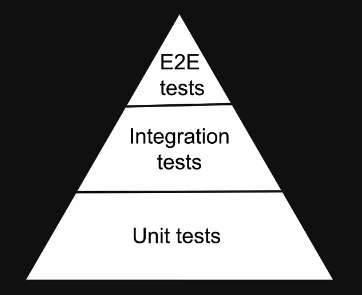

# React Testing (hand written notes)

## 3. Jest vs React Testing Library

### Jest

- Jest is a JavaScript framework
- Jest is a test runner that finds tests, runs the tests, determines whether the tests passed or failed and reports it back in a human readable manner

### React Testing Library

- RTL is a JavaScript testing utility that provides virtual DOM for testing React components
- RTL provides a virtual DOM which we can use to interact with and verify the behaviour of a React component
- RTL is a family of packages which helps test UI components
- The core library is called DOM Testing Library and RTL is a wrapper around this core library to test React applications in an easier way

---

## 4. Types of Tests

### Unit Tests

- Focus on testing the individual building blocks of an application such as a class or a function or a component
- Each unit or building block is tested in isolated, independent of other units
- Dependencies are mocked
- Run in a short amount of time and make it very easy to pinpoint failures
- Relative easier to write and maintain

### Integration Tests

- Focus is on testing a combination of units and ensuring they work together
- Take longer than unit tests

## End to End Tests

- Focus is on testing the entire application flow and ensuring it works as designed from start to finish
- Involves a real UI, a real backend database, a real service etc.
- Take the longest, as they cover the most amount of code
- Have a cost implication as you interact with real APIs that may charge based on the number of requests

### Testing Pyramid



- the bulk of your tests are Unit Tests at the bottom of the Pyramid
- As you move up the Pyramid your tests get larger but at the same time the number of tests gets smaller
- Unit Tests are easier to write and maintain, but End to End tests give you the most confidence as they closely resemble a User testing your application

- RTL Philosophy: "The more your tests resemble the way your software is used, the more confidence they can give you."

- RTL strikes a balance between Unit tests in the sense they are at a component level and easy to write and maintain and End to End tests in the sense they resemble the way a user would interact with the Component.

- With RTL we are not concerned about the implementation details of a component (We are not testing how it is rendering text or how it is updating state or how it is handling a click event)

- Instead we are testing how the component behaves when a user interacts with it.

(Example: RTL doesn't care if you add 4+4 or 5+3 to display the number 8)

- Any refactoring done to a Component with not affect your test as long as the end result is the same (Functional Testing?)

### What is an Automated Test?

- It throws an error when the actual output does not match the expected output

Basic JavaScript Test Example (without Library/Framework):

```js
function getFullName(firstName, lastName) {
  return `${firstName} ${lastName}`;
}

const actualFullName = getFullName("Baz", "Murphy");
const expectedFullName = "Baz Murphy";

if (actualFullName !== expectedFullName) {
  throw new Error(`${actualFullName} is not equal to ${expectedFullName}`);
}
```

---

## 5. Project Setup

- Install react typescript project (using CRA)
- CRA already has jest and react testing library already installed and configured with some defaults
- It provides a sample test and script to run tests in the project

---

## 6. Running Tests

In `cra/src/` we have `App.tsx` but also `App.test.tsx`
We can run this test with Jest
In `package.json` we have a `test` script `"test": "react-scripts test",` this will call Jest

```shell
 PASS  src/App.test.tsx
  √ renders learn react link (27 ms)

Test Suites: 1 passed, 1 total
Tests:       1 passed, 1 total
Snapshots:   0 total
Time:        10.638 s
Ran all test suites.
```

---

## 7. Anatomy of a Test

- `test()` accepts 3 arguments:

  1. name - the first argument is the test name used to identify the test
  2. function - the second argument is the function that contains the expectations to test
  3. timeout - the third argument is the timeout which is an optional argument for specifying how long to wait before aborting the test. the default timeout value is 5 seconds.

- Note we can also use `it()` as an alternative to `test()`

```jsx
import { render, screen } from "@testing-library/react";
import App from "./App";

test("renders learn react link", () => {
  render(<App />);
  const linkElement = screen.getByText(/learn react/i);
  expect(linkElement).toBeInTheDocument();
});
```

1. we use the `test` method from Jest
2. argument 1: name `renders learn react link`
3. argument 2: function `() => {}`
4. We use the `render` method from React Testing Library to create a Virtual DOM using the `App` component
5. We use `screen` from React Testing Library which contain methods to query the Virtual DOM
6. We use `.getByText()` which accepts a string or a regular expression as its argument `/learn react/i`
7. We `expect` the `linkElement` `.toBeInTheDocument()` (which is called a matcher function)
8. If we run this test it Passes
9. notice that `test` and `expect` are not imported because CRA globally provides those from Jest
10. So we use Jest and React Testing Library to create a test in a React Project.

---

## 8. First Test

1. Create a `Greet.tsx` component

```jsx
export const Greet = () => {
  return <div>Hello</div>;
};
```

2. Create a `Greet.test.tsx` test

```jsx
import { render, screen } from "@testing-library/react";
import { Greet } from "./greet";

test("Greet renders correctly", () => {
  render(<Greet />);
  const textElement = screen.getByText("Hello");
  expect(textElement).toBeInTheDocument();
});
```

---

## 9. Test Driven Development

- Test Driven Development is a software development process where you write tests before writing the software code
- Once the tests have been written, you then write the code to ensure the tests pass

1. Create tests that verify the functionality of a specific feature
2. Write software code that will run the tests successfully when re-executed
3. Refactor the code for optimisation while ensuring the tests continue to pass

- Also called red-green teesting as all tests go from a red failed state to a green passed state

- We write a new test `GreetTDD.test.tsx`
- We create an empty `GreetTDD.tsx`

```jsx
import { render, screen } from "@testing-library/react";
import { GreetTDD } from "./GreetTDD";

test("GreetTDD renders correctly", () => {
  render(<GreetTDD />);
  const textElement = screen.getByText("Hello");
  expect(textElement).toBeInTheDocument();
});

test("GreetTDD renders with a name", () => {
  render(<GreetTDD name={"Baz"} />);
  const textElement = screen.getByText("Hello Baz");
  expect(textElement).toBeInTheDocument();
});
```

- We then run the Test and of course it FAILs both
- We write the `GreetTDD.tsx` component
- (TypeScript: we define a Props Type with OPTIONAL `name?`)

```jsx
type GreetTDDProps = {
  name?: string,
};

export const GreetTDD = (props: GreetTDDProps) => {
  return <div>Hello {props.name}</div>;
};
```

- And now run the Tests and they PASS

---

## 10. Jest Watch Mode

- When we run `npm run test` it starts Jest in `--watch` mode
- Watch Mode is an option that we can pass to Jest asking to watch files that have changed since the last commit and execute tests related only to those changed files
- An optimisation designed to make your tests run fast regardless of how many tests you have

## 11. Filtering Tests

- we can use `w` then `o` to only run tests related to changed files
- we can use `p` to filter by filename - we then enter a regex pattern (or some text and select the file)
- we can use `t` to filter by the test name - we then enter some text and select the test
- to clear the filter use `w` and then `c`

- on the global `test()` method you can use `.only` so `test.only()` in which case Jest will pickup only that test to run
- using `.only()` is common when working on a file that contains multiple tests
- using `.skip()` will tell Jest to skip that test

- when using `it()` instead of `test()`
  - the equivalent for `only` is `f` (focus it) so: `fit()`
  - the equuivalent for `skip` is `x` (exclude it) so: `xit()`

### 12. Grouping Tests

- If you want to group your tests with Jest you can use the `describe()`

- `describe()` accepts 2 arguments:

  1. name - the first argument is the group name
  2. function - the second argument is the function that contains the tests to be executed

- we can also rename the tests so they read better in the output.
- Greet
  - renders correctly
  - renders with a name

```jsx
import { render, screen } from "@testing-library/react";
import { GreetGroup } from "./GreetGroup";

describe("Greet", () => {
  test("renders correctly", () => {
    render(<GreetGroup />);
    const textElement = screen.getByText("Hello");
    expect(textElement).toBeInTheDocument();
  });

  describe("Nested", () => {
    test("renders with a name", () => {
      render(<GreetGroup name={"Baz"} />);
      const textElement = screen.getByText("Hello Baz");
      expect(textElement).toBeInTheDocument();
    });
  });
});
```

```shell
 PASS  src/components/GreetGroup.test.tsx
  Greet
    √ renders correctly (24 ms)
    √ renders with a name (3 ms)
```

- we can also use `.only` and `.skip` with `describe()`

- it is possible to nest `describe()` blocks

```jsx
import { render, screen } from "@testing-library/react";
import { GreetGroup } from "./GreetGroup";

describe("Greet", () => {
  test("renders correctly", () => {
    render(<GreetGroup />);
    const textElement = screen.getByText("Hello");
    expect(textElement).toBeInTheDocument();
  });

  describe("Nested", () => {
    test("renders with a name", () => {
      render(<GreetGroup name={"Baz"} />);
      const textElement = screen.getByText("Hello Baz");
      expect(textElement).toBeInTheDocument();
    });
  });
});
```

```sh
 PASS  src/components/GreetGroup.test.tsx
  Greet
    √ renders correctly (21 ms)
    Nested
      √ renders with a name (1 ms)
```

- A "Test Suite" according to Jest is **one file**, and not a `describe()` block, although you group tests together using `describe()` it does not correspond to a "Test Suite".

### 13. Filename Conventions

- We are not restricted to the `FileName.test.tsx` convention with CRA and Jest

  - Files with `.test.js` or `.test.tsx` suffix
  - Files with `.spec.js` or `.spec.tsx` suffix
  - Files with `.js` or `.tsx` suffix in `__tests__` folders (at any depth in the src folder)

- Recommended to always put your tests next to the code they are testing so that relative imports are shorter

### 14. Code Coverage

- A metric that can help you understand how much of your software code is tested, A useful metric that can help tell you the quality of your test suite

  - Statement Coverage: How many statements in the software code have been executed
  - Branches Coverage: How many branches of the control structures (if statements for instance) have been executed
  - Function Coverage: How many of the functions defined have been called
  - Line Coverage: How many of the lines of source code have been tested

- With CRA and Jest you can add Test Coverage information

- In `package.json` we add a new `script`: `"coverage": "react-scripts test --coverage --watchAll",`

```sh
---------------------|---------|----------|---------|---------|-------------------
File                 | % Stmts | % Branch | % Funcs | % Lines | Uncovered Line #s
---------------------|---------|----------|---------|---------|-------------------
All files            |   38.88 |        0 |   66.66 |   38.88 |
 src                 |    8.33 |        0 |   33.33 |    8.33 |
  App.tsx            |     100 |      100 |     100 |     100 |
  index.tsx          |       0 |      100 |     100 |       0 | 7-19
  reportWebVitals.ts |       0 |        0 |       0 |       0 | 3-10
 src/components      |     100 |      100 |     100 |     100 |
  Greet.tsx          |     100 |      100 |     100 |     100 |
  GreetGroup.tsx     |     100 |      100 |     100 |     100 |
  GreetTDD.tsx       |     100 |      100 |     100 |     100 |
---------------------|---------|----------|---------|---------|-------------------
```

- We can specify where we want to get the coverage statistics from by adding this flag to the script above `--collectCoverageFrom='src/components/**/*.{ts,tsx}'",`

```sh
----------------|---------|----------|---------|---------|-------------------
File            | % Stmts | % Branch | % Funcs | % Lines | Uncovered Line #s
----------------|---------|----------|---------|---------|-------------------
All files       |     100 |      100 |     100 |     100 |
 Greet.tsx      |     100 |      100 |     100 |     100 |
 GreetGroup.tsx |     100 |      100 |     100 |     100 |
 GreetTDD.tsx   |     100 |      100 |     100 |     100 |
----------------|---------|----------|---------|---------|------------------
```

- If we want to ignore files for example `something.types.ts` where we store our TypeScript types or test files etc we can add another flag with (!) not `--collectCoverageFrom='!src/components/**/*.{types,stories,constants,test,spec}.{ts,tsx}'`

```sh
-------------------|---------|----------|---------|---------|-------------------
File               | % Stmts | % Branch | % Funcs | % Lines | Uncovered Line #s
-------------------|---------|----------|---------|---------|-------------------
All files          |     100 |      100 |     100 |     100 |
 Greet.tsx         |     100 |      100 |     100 |     100 |
 GreetGroup.tsx    |     100 |      100 |     100 |     100 |
 GreetTDD.tsx      |     100 |      100 |     100 |     100 |
 GreetWithType.tsx |     100 |      100 |     100 |     100 |
-------------------|---------|----------|---------|---------|-------------------
```

- with Jest it is possible to ENFORCE a minimal Coverage Threshold for Coverage Reports, if Thresholds are not met Jest will fail

- in `package.json` we add `"jest"` with a bunch of options
- if any of the first 3 fall below 80% Jest will fail, and if there are more than 10 uncovered statements Jest will fail

```json
  "jest": {
    "coverageThreshold": {
      "global": {
        "branches": 80,
        "functions": 80,
        "lines": 80,
        "statements": -10
      }
    }
  }
```

- Now if we add branching logic to our Component

```jsx
import { GreetProps } from "./Greet.types";

export const GreetWithBranchingLogic = (props: GreetProps) => {
  return <div>Hello {props.name ? props.name : "Guest"}</div>;
};
```

- And we apply a regex on the expected Text

```jsx
import { render, screen } from "@testing-library/react";
import { GreetWithBranchingLogic } from "./GreetWithBranchingLogic";

describe("GreetWithBranchingLogic", () => {
  test("renders correctly", () => {
    render(<GreetWithBranchingLogic />);
    const textElement = screen.getByText(/Hello/);
    expect(textElement).toBeInTheDocument();
  });
});
```

- We get a `Jest: "global" coverage threshold for branches (80%) not met: 50%`

```sh
-----------------------------|---------|----------|---------|---------|-------------------
File                         | % Stmts | % Branch | % Funcs | % Lines | Uncovered Line #s
-----------------------------|---------|----------|---------|---------|-------------------
All files                    |     100 |       50 |     100 |     100 |
 Greet.tsx                   |     100 |      100 |     100 |     100 |
 GreetGroup.tsx              |     100 |      100 |     100 |     100 |
 GreetTDD.tsx                |     100 |      100 |     100 |     100 |
 GreetWithBranchingLogic.tsx |     100 |       50 |     100 |     100 | 4
 GreetWithType.tsx           |     100 |      100 |     100 |     100 |
-----------------------------|---------|----------|---------|---------|-------------------
Jest: "global" coverage threshold for branches (80%) not met: 50%
```

- Jest also generates an HTML file of your coverage in `coverage/lcov-report/index.html`
- If you go into the browser and view it, and you click the file with the problem, it automatically highlights the branch

- Do Not Focus on getting 100% Code Coverage because it doesn't guarantee that you have written good tests covering critical parts of your application
- With that being said 80% Code Coverage is a good goal to aim for (and make it part of your Continuous Integration Pipeline)

### 15. Assertions

- When writing tests we often need to check that values meet certain conditions
- Assertions decide if a test passes or fails

- with Jest assertions are carried out with the global `expect()` method
- the `expect(value)` method accepts 1 argument
- the `value` argument should be the value that your code produces

- in the `Greet` example it is a DOM Node

- You will rarely call `expect()` by itself

- Typically you will use expect along with a **"matcher"** function to assert something about a value

- A **"matcher"** can optionally accept an argument which is the correct expected value

- in the `Greet` example is it `.toBeInTheDocument()` which does not need an argument and verfies if the DOM Node is present in the DOM

- To start with its hard to know which **"matcher"** functions we can use when writing a test, so visit https://jestjs.io/docs/using-matchers to see a list of commonly used **"matchers"**

  - Numbers:
  - `expect(value).toBeGreaterThan(3);`
  - `expect(value).toBeLessThan(5);`

  - Strings:
  - `expect('Christoph').toMatch(/stop/);`

  - Arrays/Iterables:
  - `expect(shoppingList).toContain('milk');`

  - Error
  - `expect(() => compileAndroidCode()).toThrow(Error);`

- Jest out of the box contains **"matcher"** functions for JavaScript testing that does not involve a UI or the DOM.

- We extend the list of Jest **"matchers"** by adding an additional package called `jest-dom`

- With CRA `jest-dom` is already installed for us if we look in `package.json` we can see in `"dependencies":` `"@testing-library/jest-dom": "^5.17.0",` and if we look at `setupTests.ts` we can see `import '@testing-library/jest-dom';`

- `setupTests.ts` is a global file that is automatically executed before Jest runs a test

- if we visit https://github.com/testing-library/jest-dom we can see a list of Custom Matchers as well as Documentation for WHEN to use a particular **"matcher"** function
  - `toBeInTheDocument`
  - `toBeEnabled` - for buttons/inputs
  - `toHaveClass`
  - `toHaveValue`

### 16. What to Test?

- Guideline starting point for what is worth testing in a React Component

- Test that the Component **renders**

- Test that the Component renders **when given props**

- Test that the Component renders **in different states** (eg. user logged in or not)

- Test that the Component **reacts to events** (eg. buttons / form controls)

#### What Not To Test

- Implementation Details - the more closely your tests resemble how the software is being used the better - you want tests that test the behaviour and not how that behaviour is implemented

- Third Party Code - you should be testing code that you are writing in your Project and not code you are consuming from an external library

- Code that is not Important from a User's Point of View (eg. a utility function to format a Date - only test if the date was rendered in the expected format)
